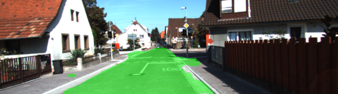

## Writeup for Semantic Segmentation Project

### Training

Training parameterss for FCN was selected as: `batch_size=4`, `epochs=25`. As an optimizer was selected `AdamOptimizer` with learning rate `lr=0.001`. Interestingly that on bigger batch size like 10 or 20 model don't show any meaningful segmentation results (at least within first 25 epochs)

### Results

#### Tests Table for some parameters

Freeze Gradient | Batch Size | Epochs | Shuffle | Loss
---             | ---        | ---    | ---     | ---
1               | 4          | 25     | 0       | 0.059
1               | 4          | 25     | 1       | 0.064    
0               | 4          | 25     | 1       | 0.025
0               | 2          | 25     | 1       | 0.039
0               | 1          | 25     | 1       | 0.061
0               | 6          | 25     | 1       | 0.023
0               | 8          | 25     | 1       | 0.025
**0**           | **3**      | **100**  | **1**  | **0.007**
0               | 3          | 25     | 1       | 0.031
0               | 4          | 50     | 1       | 0.009

#### Testing Images Example Predictions (for best params)

Some image results from the final selected parameters.

